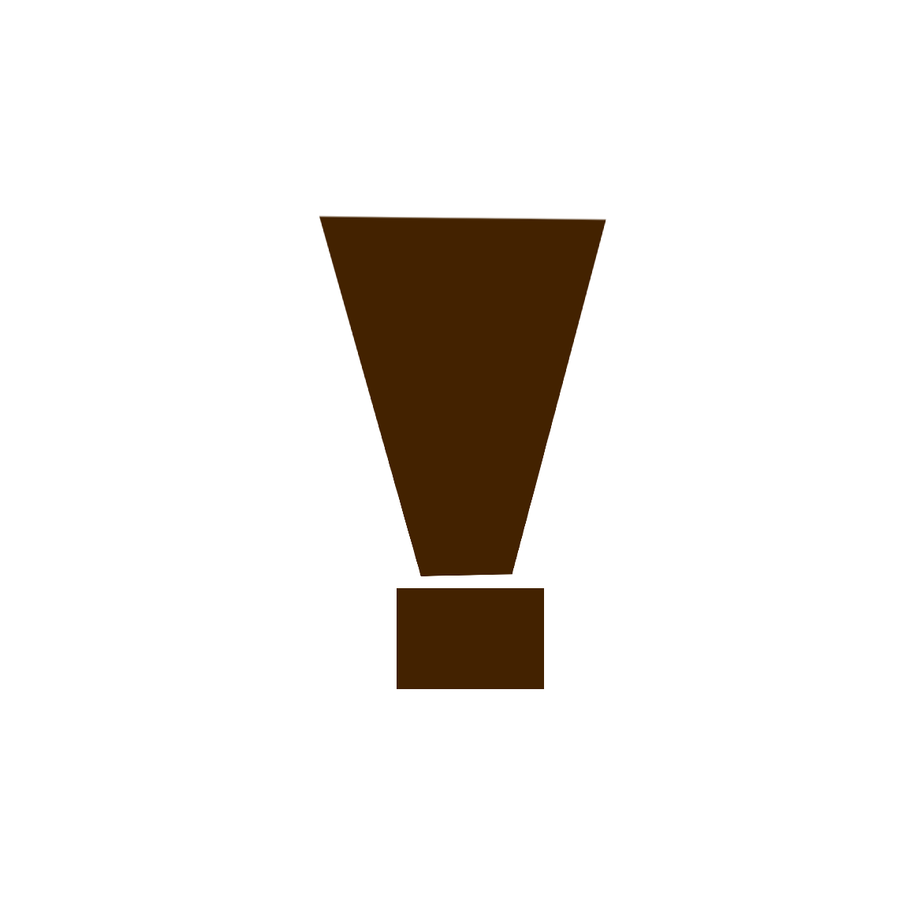

# thepegleg
<p align="center">

</p>

## Overview

thepegleg is a gaming website done differently.

## Features

- **Pretty much unblockable:** Easily accessable from many access points.
- **Games:** ~11000 games, constantly expanding.
- **Built in proxy:** Ultraviolet proxy is built in (credit to TIW)
- **Proxy links:** ~1900 proxy links, regularly scraped from discord & skipschool.
- **Movies & Shows** Movie and TV search and streaming with all your favorites.
- **Chatgpt:** Unblocked and working AI.
- **Reddit:** teddit instance hosted by us
- **TikTok:** sticktok, proxied through us
- **Chat:** Interact with thepegleg discord, on the site
- **Quick updates:** Ask for whatever, and we will try our best to put it on thepegleg.
- **Ad free forever:** There should be nothing to distract you from your distractions, ever. If I can remove the ads from something, I will.
- **Really cool:** The website is really cool.

## How to access
### Go to any of the following access points and follow instructions 
- [pegleg.cbass92.org](https://pegleg.cbass92.org) click on the word Atlas on the 404 page. 
- [TYPE ANYTHING RIGHT HERE.cbass92.org](http://hfkjsdhfskjdfhsjfh.cbass92.org) Above
- http://fishsounds.fishfx.com	(freedns)
- http://ima.logical-hazard.ro (freedns)
- http://helpi.lostbytes.me (freedns)
- http://alpha.malewolf.com (freedns)
- http://joe.sleepgate.im (freedns)
- [sciency.scienceontheweb.net](https://sciency.scienceontheweb.net) type in 69420 and click on the results in the calc.
- [goldengrain.rf.gd](http://goldengrain.rf.gd/) Click the on 1995 in the about section
- [wtech.42web.io](http://wtech.42web.io/) Click on cybersecurity in the service section
- [join the discord for TONS more links](https://discord.gg/8Es3wpnPWd) please

## Make your own access point
### freedns.afraid.org (SUPER EASY) (Now with SSL!) (New server!)
Create an A record with `104.36.86.105` as the IP
#### note: use the non default domains, the others are usually auto blocked
#### other note: I can see what domains you use, and they will be added to the public domain list
### Use a template
Easy way, follow instructions at [ThePlank](https://github.com/sebastian-92/ThePlank/README.md)

### Custom access point
To make a custom access point, put this html anywhere on your website. the only thing you can't edit is the link, everything else should be fine:
```
<a href="javascript:void(0);" onclick="var newTab = window.open('about:blank'); newTab.document.write('<head><title>Classroom</title><link rel=\'icon\' type=\'image/png\' href=\'gc.png\'></head><embed allowfullscreen=\'true\'src=\'https://hfhjdkfghsdfkjghsdfjkhg.cbass92.org/asdjklhfskjafhakfhueoyraehfjkcnjkdscnsjakdreuoiwefh/index.html\' style=\'position: absolute; top: 0; left: 0; width: 100%; height: 100%; border: none;\'>'); return false;" style="text-decoration: none;">Atlas</a>
```

### Bookmarklet
Put this in your bookmarks bar:
```
javascript:(function(){var newTab = window.open('about:blank');newTab.document.write('<head><title>Classroom</title><link rel=\'icon\' type=\'image/png\' href=\'gc.png\'></head><embed allowfullscreen=\'true\' src=\'https://thepegleg.github.io/asdjklhfskjafhakfhueoyraehfjkcnjkdscnsjakdreuoiwefh/index.html\' style=\'position: absolute; top: 0; left: 0; width: 100%; height: 100%; border: none;\'>');})()
```

## Using on your own server
PLEASE contact me before doing so

## Contributing

We are really, really open to contributors. Just make an issue saying what you want to change, and we will invite you to the organization within a few days, unless we do not like you for some reason.

## Credits

- Project Lead: [Cbass92]
- Contributors: [elsgcreate]
- Game sources: Crazygames, 3kh0 assets, 3kh0 relived, armorgames, coolmathgames, stickpage.com, flash in the pan, flashpoint, y8.

## License

This project is licensed under the [RACL License](LICENSE).
